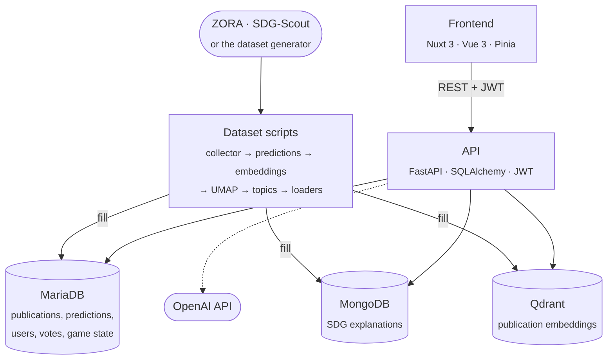

<div align="center">

# SDG Tag Heroes

**A gamified, collaborative platform for labeling scientific publications with the
[UN Sustainable Development Goals](https://sdgs.un.org/goals)**


[Quick start](#quick-start) · [Dummy dataset](#dummy-dataset) · [API](#api) · [Documentation](#documentation)

</div>

---

SDG Tag Heroes maps scientific publications to the 17
[Sustainable Development Goals (SDGs)](https://sdgs.un.org/goals). Machine-learning models predict which SDGs a
publication addresses. Players ("heroes") review these predictions, vote on the correct SDG, write annotations, and
earn XP and coins for their contributions. It was built for a master's thesis at the University of Zurich (UZH).

Once a publication has enough votes, it gets a **scenario**, which tells players what kind of help it needs:

| Scenario        | Situation                                        | Example vote split |
|-----------------|--------------------------------------------------|--------------------|
| **Confirm**     | A clear favourite needs confirmation             | 6 / 4              |
| **Tiebreaker**  | Two SDGs are tied                                | 5 / 5              |
| **Investigate** | The votes are spread across several SDGs         | 3 / 3 / 3 / 1      |
| **Explore**     | There is no agreement at all                     | 1 / 2 / 2 / 2 / 1… |

When the players reach a consensus, a **label decision** is stored: by majority, by technocratic consensus, or by an
expert.

## Features

- 🎯 **SDG predictions** per publication, for goals and targets, with entropy and standard deviation as uncertainty
- 🗺️ **Exploration maps**: UMAP projections of publication embeddings, with topics per SDG and level
- 🔍 **Similarity search** over publication embeddings in Qdrant
- 🖍️ **Explanations**: the words of an abstract that point to an SDG are highlighted while labeling
- 🤖 **GPT assistance**: SDG explanations, keywords, facts, summaries, and evaluation of comments and annotations
- 🏆 **Gamification**: XP and coins per SDG, ranks, a leaderboard, quests and user profiles

> [!NOTE]
> The original dataset consists of publications from [ZORA](https://www.zora.uzh.ch/), the open repository of UZH.
> These publications belong to their authors and UZH, so **the data is not part of this repository**. The
> [dummy dataset](#dummy-dataset) lets you run the application without it.

## Contents

- [Tech stack](#tech-stack)
- [Architecture](#architecture)
- [Repository structure](#repository-structure)
- [Quick start](#quick-start)
- [Services and ports](#services-and-ports)
- [Configuration](#configuration)
- [API](#api)
- [Data](#data)
- [Dummy dataset](#dummy-dataset)
- [Building the dataset](#building-the-dataset)
- [Development](#development)
- [Documentation](#documentation)
- [Known issues](#known-issues)
- [Acknowledgements](#acknowledgements)

## Tech stack

| Area               | Technologies |
|--------------------|--------------|
| **Frontend**       |           |
| **Backend**        |        |
| **Databases**      |    |
| **ML and AI**      |         |
| **Data pipeline**  |  ZORA (OAI-PMH) harvesting, Aurora and SciBERT SDG models |
| **Infrastructure** |    |

## Architecture



| Store       | Holds |
|-------------|-------|
| **MariaDB** | The relational core: publications, authors, SDG goals and targets, predictions, users, votes, annotations, label decisions, XP and coin histories, collections and map coordinates. The schema is defined by the SQLAlchemy models in [`models/`](models) and migrated with Alembic. |
| **MongoDB** | The precomputed SDG explanations: per-token scores shown while labeling. |
| **Qdrant**  | The publication embeddings (`sentence-transformers/all-MiniLM-L6-v2`, 384 dimensions) in the collection `publications-mt`, used for similarity search, maps and topics. |

The API, the databases and the frontend run in Docker. The dataset scripts run on your machine. See
[Architecture](docs/architecture.md) for the code layers.

## Repository structure

| Path                                  | Content                                                                        |
|---------------------------------------|--------------------------------------------------------------------------------|
| [`api/`](api)                         | FastAPI application ([`main.py`](api/app/main.py)) and its routes              |
| [`models/`](models)                   | SQLAlchemy models (MariaDB tables)                                             |
| [`schemas/`](schemas)                 | Pydantic response schemas                                                      |
| [`request_models/`](request_models)   | Pydantic request bodies                                                        |
| [`services/`](services)               | Business logic: decisions, rewards, scoring, labels, metrics, GPT strategies   |
| [`enums/`](enums)                     | Shared enums: roles, scenarios, vote and decision types                        |
| [`settings/`](settings)               | Central configuration ([`settings.py`](settings/settings.py)) and SDG texts    |
| [`db/`](db)                           | Database connectors and scripts to create and check the MariaDB schema         |
| [`alembic/`](alembic)                 | Database migrations                                                            |
| [`pipeline/`](pipeline)               | Data pipeline: ZORA collector, SDG predictors, embeddings, UMAP, Prefect flow  |
| [`utils/`](utils)                     | Loader scripts for MariaDB, MongoDB and Qdrant, dummy dataset, backups, logger |
| [`frontend/`](frontend)               | Nuxt 3 frontend ([README](frontend/README.md))                                 |
| [`deploy/`](deploy)                   | Dockerfiles and container entrypoints                                          |
| [`env/`](env)                         | Environment files; only the `*.example` templates are committed                |
| [`docs/`](docs)                       | Documentation ([index](docs/README.md))                                        |
| [`notebooks/`](notebooks)             | Exploration notebooks: topic modelling, model comparison                       |
| [`prompts/`](prompts)                 | An example prompt and answer of the GPT assistant                              |

## Quick start

### Prerequisites

- [Docker](https://docs.docker.com/get-docker/) with Docker Compose v2
- [Node.js](https://nodejs.org/) 20 or newer, to run the frontend on your machine (optional)
- Python **3.10.14** and [Poetry](https://python-poetry.org/), to build the dataset
  ([setup](docs/development.md#python-environment))
- An [OpenAI API key](https://platform.openai.com/api-keys) for the GPT features; everything else works without one

### 1. Clone the repository

```bash
git clone https://github.com/HuberNicolas/sdg-tag-heroes.git
```

```bash
cd sdg-tag-heroes
```

### 2. Create the environment files

Every service reads its configuration from `env/<service>.env`. Copy all templates:

```bash
for f in env/*.env.example; do cp "$f" "${f%.example}"; done
```

Then fill in the empty values:

| File                | What to set                                                                                      |
|---------------------|--------------------------------------------------------------------------------------------------|
| `mariadb.env`       | `MYSQL_ROOT_PASSWORD`, `MARIADB_USER`, `MARIADB_PASSWORD`. The database name defaults to `igcl`. |
| `mongodb.env`       | `MONGO_INITDB_ROOT_USERNAME`, `MONGO_INITDB_ROOT_PASSWORD`, and `MONGODB_HOST=mongodb`           |
| `mongo-express.env` | The UI login, and `ME_CONFIG_MONGODB_URL=mongodb://<user>:<password>@mongodb:27017`              |
| `backend.env`       | `SECRET_KEY`: a long random string that signs the JWTs                                           |
| `api.env`           | `OPENAI_API_KEY`                                                                                 |
| `users.env`         | The initial accounts (admin, labeler, expert). **Change the default passwords.**                 |

`qdrantdb.env`, `phpmyadmin.env` and `portainer.env` work as they are.

### 3. Start the databases and the API

```bash
docker compose up -d --build api mariadb phpmyadmin mongodb mongo-express qdrantdb
```

Check that the API has connected to all three databases:

```bash
docker compose logs -f api
```

The API runs at <http://localhost:1002>, with interactive docs at <http://localhost:1002/docs>.

### 4. Fill the databases

Choose one of three options:

| Option                                                          | When                                            | Time             |
|-----------------------------------------------------------------|-------------------------------------------------|------------------|
| **A. [Dummy dataset](#dummy-dataset)**                          | You do not have the original data               | about 10 minutes |
| **B. [Restore a backup](docs/databases.md#backup-and-restore)** | You have database dumps                         | minutes          |
| **C. [Build from scratch](#building-the-dataset)**              | You have access to ZORA and the SDG-Scout files | hours            |

### 5. Start the frontend

The frontend reads the API address from `frontend/.env`:

```bash
cp frontend/.env.example frontend/.env
```

Then start it in Docker, with hot reload:

```bash
docker compose up -d --build frontend
```

Open <http://localhost:3030> and log in with an account from `env/users.env`. To run the frontend on your machine
instead, see the [frontend README](frontend/README.md).

### Stop everything

```bash
docker compose down
```

The database contents are stored in `data/docker/` and survive a restart.

## Services and ports

All services run in the Docker network `sdg-tag-heroes-net` (`10.5.0.0/24`). `docker compose --profile prod up -d`
starts every service of the `prod` profile.

| Service         | Container          | Host port | Profile    | Purpose                                      |
|-----------------|--------------------|----------:|------------|----------------------------------------------|
| `api`           | `api`              | 1002      | prod       | FastAPI backend (hot reload on code change)  |
| `mariadb`       | `mariadb-database` | 2001      | prod       | Relational database                          |
| `phpmyadmin`    | `phpmyadmin`       | 2011      | prod       | MariaDB web UI                               |
| `mongodb`       | `mongodb-database` | 2002      | prod       | Document database (SDG explanations)         |
| `mongo-express` | `mongo-express`    | 2022      | prod       | MongoDB web UI                               |
| `qdrantdb`      | `qdrant-database`  | 2003      | prod       | Vector database; dashboard at `/dashboard`   |
| `frontend`      | `frontend`         | 3030      | prod       | Nuxt dev server with hot reload              |
| `portainer`     | `portainer`        | 1000      | prod       | Docker management UI                         |
| `utils`         | `utils`            | –         | dev, debug | Shell with MariaDB and MongoDB client tools   |

How to log in to the database UIs is described in [Databases](docs/databases.md). More Docker commands are in
[Docker](docs/docker.md).

## Configuration

| Setting                       | Where                                 | Default  | Meaning                                                                        |
|-------------------------------|---------------------------------------|----------|--------------------------------------------------------------------------------|
| `PREDICTION_MODEL`            | shell, or environment of `docker compose` | `Aurora` | Model whose predictions drive maps, levels and quests: `Aurora` or `Dvdblk` |
| `API_URL`                     | `frontend/.env`                       | –        | Where the browser reaches the API, e.g. `http://localhost:1002`                |
| `NUXT_PUBLIC_API_URL`         | production frontend container         | –        | The same, at runtime of the [production image](frontend/README.md#production)  |
| `NUXT_PUBLIC_MAP_PARTITIONS`  | `frontend/.env`                       | `1000`   | Parts the overview map is split into; use `3` for the dummy dataset            |
| `ACCESS_TOKEN_EXPIRE_MINUTES` | `env/backend.env`                     | `30`     | Lifetime of a login token                                                      |

The tunable values of the application itself (prediction threshold, votes needed for a scenario, GPT model, UMAP
parameters, …) are in [`settings/settings.py`](settings/settings.py).

## API

The API is a FastAPI application. With the containers running, the interactive reference is at
<http://localhost:1002/docs> (Swagger UI) and <http://localhost:1002/redoc>.

Get a token by posting your e-mail and password as JSON:

```bash
curl -X POST http://localhost:1002/auth/login -H 'Content-Type: application/json' -d '{"email": "labeler@tagheroes.ch", "password": "<password>"}'
```

Send it as `Authorization: Bearer <token>` with every other request. In Swagger UI, use the **Authorize** button.

A **Postman collection** with all 111 requests is in
[`docs/api/sdg-tag-heroes.postman_collection.json`](docs/api/sdg-tag-heroes.postman_collection.json). Import it, set
the `password` variable, and send **auth → Login**; every other request then uses the token. The
[API guide](docs/api/README.md) lists the endpoint groups and explains how to regenerate the collection.

## Data

The application expects a `data/` folder in the repository root. It is not published because it contains UZH
publications and data derived from them.

The ground-truth labels, SDG clusters and SDG explanations come from **SDG-Scout**, an earlier project of the same
research group at UZH, and were created together with that group. They are not public either.

```
data/
├── api/umap_model/                  # Trained UMAP models, used by the API (step 7)
├── db/
│   ├── igcl_dump.sql                # MariaDB dump (restore)
│   ├── *.snapshot                   # Qdrant snapshot of publications-mt (restore)
│   ├── explanations/                # SDG explanations for MongoDB (step 10)
│   ├── sdg_label_summary.txt        # Ground-truth labels (step 9)
│   ├── full_dataset_clusters.json   # SDG clusters (step 8)
│   └── publications_clusters.txt    # Publication-to-cluster assignments (step 8)
├── docker/                          # Volumes of the running containers (created automatically)
├── icons/                           # SDG goal and target SVGs, sdg_extras.json (step 2)
├── pipeline/
│   ├── aurora_models/               # Aurora models (step 5)
│   ├── model/                       # SciBERT model (step 5)
│   ├── oai/                         # OAI-PMH files of the dummy dataset (step 4)
│   └── collections/                 # BERTopic output (step 8)
└── ranks/sdg_ranks.json             # Rank tiers (step 2)
```

To delete all container data and start from empty databases, run `bash utils/docker/delete-docker-data.sh`. It
removes `data/docker/`.

## Dummy dataset

The companion repository
[sdg-tag-heroes-dataset-generator](https://github.com/HuberNicolas/sdg-tag-heroes-dataset-generator) generates
fictional publications, so the application can be built and run without the original data. The generator only
replaces the two external sources. Everything else is computed by the scripts in this repository.

| Original source | Replaced by the generator                                                                        | Read by                       |
|-----------------|--------------------------------------------------------------------------------------------------|-------------------------------|
| ZORA            | Publications as OAI-PMH files in `data/pipeline/oai/`                                            | `collector.py --from-dir`     |
| SDG-Scout       | Ground-truth labels (`data/db/sdg_label_summary.txt`) and explanations (`data/db/explanations/`) | label and explanation loaders |
| –               | Placeholder SDG icons, SDG texts and rank tiers (`data/icons/`, `data/ranks/`)                   | SDG and rank loaders          |

The SDG predictions come from the SciBERT model `Dvdblk`, because the Aurora models need TensorFlow (see
[SDG predictions](docs/dataset.md#5-sdg-predictions)). The application therefore runs with `PREDICTION_MODEL=Dvdblk`.

> [!WARNING]
> Load the dummy dataset only into empty databases. [`load_dummy_dataset.py`](utils/dummy/load_dummy_dataset.py)
> refuses to start otherwise, and a resumed run only continues when every publication in MariaDB comes from the dummy
> dataset.

1. **Generate the data** as described in the generator's README, then copy its `output/data/` into `data/`.
   `--mode llm` writes more realistic abstracts with Claude.
2. **Start the databases and the API:**

   ```bash
   PREDICTION_MODEL=Dvdblk docker compose up -d --build api mariadb mongodb qdrantdb
   ```

3. **Set up the Python environment** for the dataset scripts ([setup](docs/development.md#python-environment)).
4. **Run all steps** from the repository root:

   ```bash
   PYTHONPATH=. python utils/dummy/load_dummy_dataset.py
   ```

   The script runs the regular scripts one after the other: schema, collector (from the files), SciBERT
   predictions, embeddings, UMAP maps, BERTopic topics, then SDGs, users, labels, topics, explanations and
   simulated players. For 600 publications it took 8 minutes on a laptop CPU. If a step fails, the script prints
   the command to resume with `--from-step <name>`.

5. **Restart the API** so it loads the new UMAP models:

   ```bash
   docker compose restart api
   ```

6. **Start the frontend** as in the [quick start](#5-start-the-frontend), with `NUXT_PUBLIC_MAP_PARTITIONS=3` in
   `frontend/.env`. The overview map is split into one part per universe, and the dummy dataset is small.

Log in with an account from `env/users.env`, or as one of the 40 generated players (`<lastname>@example.org`,
password `password01`).

**Limitations:** the template abstracts (the generator's default mode) share many phrases, so BERTopic finds only a
few topics; abstracts written with `--mode llm` give more varied topics. SciBERT rarely scores SDG 17 above 0.7, so
that SDG may have no map.

## Building the dataset

Standalone Python scripts fill the databases in eleven steps. Each step depends on the ones before it.

| Step | What                | Scripts                                                |
|-----:|---------------------|--------------------------------------------------------|
|    1 | Schema              | `db/scripts/init_mariadb.py`, `alembic stamp head`     |
|    2 | Reference data      | SDG goals, targets, icons, texts and rank tiers        |
|    3 | Users               | accounts from `env/users.env`, generated players       |
|    4 | Publications        | ZORA collector                                         |
|    5 | Predictions         | Aurora or SciBERT, then entropy and standard deviation |
|    6 | Embeddings          | Sentence Transformers → Qdrant                         |
|    7 | Maps                | UMAP projections per SDG and level                     |
|    8 | Topics and clusters | BERTopic collections, SDG clusters                     |
|    9 | Ground-truth labels | label summaries and histories                          |
|   10 | Explanations        | token-level SDG explanations → MongoDB                 |
|   11 | Fixtures            | simulated votes, comments, scenarios, XP and coins     |

**[Building the dataset](docs/dataset.md)** describes every step: the scripts, their inputs, outputs and options.

> [!WARNING]
> Some scripts **drop the database or collection** they fill, and the fixtures truncate the game tables. Run them
> only against databases you can rebuild.

## Development

| Task                              | Command or guide                                                                    |
|-----------------------------------|-------------------------------------------------------------------------------------|
| Set up the Python environment     | [Development](docs/development.md#python-environment)                               |
| Change the database schema        | `alembic revision --autogenerate -m "…"`, then `alembic upgrade head` ([Migrations](docs/migrations.md)) |
| Lint and format the frontend      | `npm run lint` and `npm run format` in `frontend/`                                  |
| Lint and format Python            | Black, isort and Flake8 ([Development](docs/development.md#linting-and-formatting)) |
| Regenerate the Postman collection | [API guide](docs/api/README.md#updating-the-collection)                             |
| Build the production frontend     | [Frontend README](frontend/README.md#production)                                    |

The API writes its logs to `data/docker/logs/`.

## Documentation

| Guide                                      | Content                                                          |
|--------------------------------------------|------------------------------------------------------------------|
| [Architecture](docs/architecture.md)       | Code layers of the backend and the frontend, models vs. schemas  |
| [Building the dataset](docs/dataset.md)    | Every dataset script, in order                                   |
| [API](docs/api/README.md)                  | Authentication, endpoint groups, Postman collection              |
| [Databases](docs/databases.md)             | Database UIs, backup and restore                                 |
| [Migrations](docs/migrations.md)           | Alembic workflow                                                 |
| [Docker](docs/docker.md)                   | Services, profiles, useful commands                              |
| [Development](docs/development.md)         | Python environment, linting, conventions, TypeScript types       |
| [Deployment](docs/deployment.md)           | Running the stack on a server                                    |
| [Troubleshooting](docs/troubleshooting.md) | Known errors and their fixes                                     |
| [Frontend](frontend/README.md)             | Frontend structure, commands and production build               |
| [TODO](TODO.md)                            | Open tasks                                                       |

## Known issues

- The Aurora predictors need TensorFlow 2.11, which is not in the Poetry environment
  (see [SDG predictions](docs/dataset.md#5-sdg-predictions)).
- An attempt to upgrade the frontend to Nuxt UI 3, Tailwind 4 and daisyUI 5 was not finished. It is kept on the
  branch `archive/frontend-nuxt-ui-3`. Do not upgrade the frontend packages without checking the layout.
- The layout is made for laptop to ultrawide screens (1280–3440 px); tablets and phones are not supported.

More open tasks are in [TODO.md](TODO.md).

## Acknowledgements

- **SDG-Scout**, an earlier project of the same research group at UZH, provided the ground-truth labels, the SDG
  clusters and the explanations of the thesis dataset.
- The **[Aurora](https://aurora-universities.eu/)** SDG models and the SciBERT model
  **[`dvdblk/scibert_sdg_cased_zo-up`](https://huggingface.co/dvdblk/scibert_sdg_cased_zo-up)** predict the SDGs.
- The publications of the thesis dataset come from **[ZORA](https://www.zora.uzh.ch/)**, the open repository of UZH.

## Author

Nicolas Huber, master's thesis, University of Zurich (UZH).
