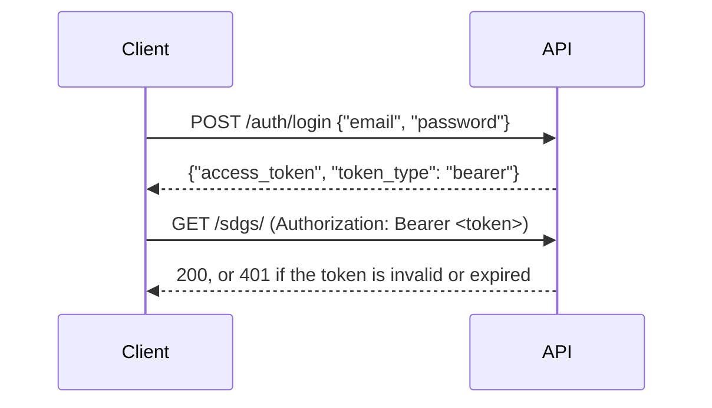

# API

The SDG Tag Heroes API is a [FastAPI](https://fastapi.tiangolo.com/) application in [`api/`](../../api). It runs in
the `api` container at <http://localhost:1002>; the [quick start](../../README.md#quick-start) explains how to start
it.

| Explore it with | Where                                                                         |
|-----------------|-------------------------------------------------------------------------------|
| **Swagger UI**  | <http://localhost:1002/docs>, generated from the code and always up to date  |
| **ReDoc**       | <http://localhost:1002/redoc>                                                 |
| **OpenAPI**     | <http://localhost:1002/openapi.json>                                          |
| **Postman**     | [`sdg-tag-heroes.postman_collection.json`](sdg-tag-heroes.postman_collection.json) in this folder |

## Contents

- [Authentication](#authentication)
- [Errors](#errors)
- [Endpoint groups](#endpoint-groups)
- [Postman collection](#postman-collection)

## Authentication

All endpoints except `POST /auth/login` and `GET /` need a JWT.



1. Log in:

   ```bash
   curl -X POST http://localhost:1002/auth/login -H 'Content-Type: application/json' -d '{"email": "labeler@tagheroes.ch", "password": "<password>"}'
   ```

2. Send the returned `access_token` with every request as `Authorization: Bearer <token>`.
3. Check a token with `GET /auth/protected`.

Tokens are signed with `SECRET_KEY` and expire after `ACCESS_TOKEN_EXPIRE_MINUTES` (both in `env/backend.env`). The
token carries the user's e-mail and roles (`labeler`, `expert`, `admin`). The accounts come from `env/users.env` or
the user loader (see [Building the dataset](../dataset.md#3-users)).

## Errors

Errors are JSON with a `detail` field:

| Status | When                                                                              |
|-------:|-----------------------------------------------------------------------------------|
|    401 | Missing, invalid or expired token; wrong e-mail or password                       |
|    404 | The resource does not exist                                                       |
|    422 | The request does not match the expected parameters or body                        |
|    500 | An unexpected error; the API logs it to `data/docker/logs/`                       |

## Endpoint groups

| Prefix                       | Requests | Resource                                                                    |
|------------------------------|---------:|-----------------------------------------------------------------------------|
| `/auth`                      |        2 | Login and token check                                                       |
| `/users`                     |        4 | Users, the own profile, filtering by role                                   |
| `/users-profiles`            |        4 | GPT suggestions: which SDGs fit a user's skills or interests                |
| `/publications`              |       17 | Publications, filters, similarity search, scenarios, GPT summaries, keywords and facts |
| `/authors`                   |        3 | Authors and their publications                                              |
| `/sdgs`                      |        2 | SDG goals and targets                                                       |
| `/sdg-predictions`           |       12 | Model predictions per publication, metrics, maps                            |
| `/explanations`              |        1 | Token-level SDG explanations (MongoDB)                                      |
| `/dimensionality-reductions` |       12 | UMAP coordinates for the exploration maps                                   |
| `/collections`               |        2 | Topic collections                                                           |
| `/user-labels`               |       12 | Votes and comments that players give on a publication                       |
| `/votes`                     |        3 | Up- and down-votes on user labels                                           |
| `/annotations`               |        7 | Annotations on publications, GPT scoring                                    |
| `/label-summaries`           |        3 | Aggregated labels per publication                                           |
| `/label-histories`           |        2 | History of label changes                                                    |
| `/label-decisions`           |       10 | Scenarios and final label decisions                                         |
| `/banks`                     |        5 | XP per SDG and its history                                                  |
| `/wallets`                   |        5 | Coins per SDG and its history                                               |
| `/ranks`                     |        4 | SDG ranks of users                                                          |

The route handlers are in [`api/app/routes/`](../../api/app/routes), the response schemas in
[`schemas/`](../../schemas) and the request bodies in [`request_models/`](../../request_models). See
[Architecture](../architecture.md#backend) for how they work together.

## Postman collection

[`sdg-tag-heroes.postman_collection.json`](sdg-tag-heroes.postman_collection.json) contains all 111 requests, one
folder per endpoint group. Each request has example bodies and example responses with placeholder values.

### Import

1. In Postman, choose **Import** and select `docs/api/sdg-tag-heroes.postman_collection.json`.
2. Open the collection, go to **Variables**, and set `password` for the account in `email`.
3. Send **auth → Login**. Its test script stores the returned token in `bearerToken`.
4. Every other request inherits the collection's Bearer auth and uses `bearerToken`.

When the token has expired, send the login request again.

| Variable      | Default                 | Meaning                                                  |
|---------------|-------------------------|----------------------------------------------------------|
| `baseUrl`     | `http://localhost:1002` | Where the API runs                                       |
| `email`       | `labeler@tagheroes.ch`  | Account used by the login request (from `env/users.env`) |
| `password`    | *(empty)*               | Password of that account                                 |
| `bearerToken` | *(empty)*               | Set by the login request                                 |

Path parameters such as `:sdg_id` are set in the **Params** tab of each request; the placeholder `<integer>` shows
the expected type.

> [!IMPORTANT]
> Do not commit the collection with a filled-in `password` or `bearerToken`. Postman stores the current values of
> collection variables in its export.

### Updating the collection

After changing the API, regenerate the collection from the OpenAPI schema of the running API. Run from the repository
root:

```bash
curl -s http://localhost:1002/openapi.json -o openapi.json
```

```bash
npx openapi-to-postmanv2@4 -s openapi.json -o converted.json -p -O folderStrategy=Paths
```

```bash
python3 docs/api/finalize_postman_collection.py converted.json docs/api/sdg-tag-heroes.postman_collection.json
```

The second command is Postman's own converter, the same one the Postman import uses.
[`finalize_postman_collection.py`](finalize_postman_collection.py) groups the requests into one folder per resource,
sets the collection's Bearer auth and variables, and adds the login test script. Delete `openapi.json` and
`converted.json` afterwards.
