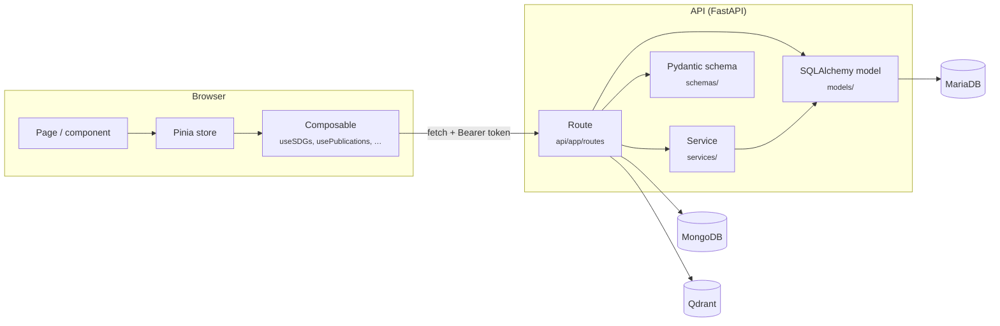

# Architecture

How the code is organised, and how a request travels from the browser to the database and back.

## Contents

- [Overview](#overview)
- [Backend](#backend)
  - [Layers](#layers)
  - [A request, step by step](#a-request-step-by-step)
  - [Models and schemas](#models-and-schemas)
  - [Configuration and logging](#configuration-and-logging)
- [Frontend](#frontend)
- [TypeScript types from the schemas](#typescript-types-from-the-schemas)

## Overview



## Backend

### Layers

| Layer              | Folder                                                  | Responsibility                                                                             |
|--------------------|---------------------------------------------------------|--------------------------------------------------------------------------------------------|
| **Routes**         | [`api/app/routes/`](../api/app/routes)                  | One router per resource. Checks the token, reads the request, calls models and services, returns a schema. |
| **Request models** | [`request_models/`](../request_models)                  | Pydantic models for request bodies (what the API accepts)                                  |
| **Schemas**        | [`schemas/`](../schemas)                                | Pydantic models for responses (what the API returns)                                       |
| **Services**       | [`services/`](../services)                              | Business logic shared by several routes: decisions and scenarios, rewards, scoring, labels, metrics, similarity search, UMAP coordinates |
| **GPT strategies** | [`services/gpt/strategies/`](../services/gpt/strategies) | One strategy per GPT task (summary, keywords, facts, SDG explanation, comment evaluation, …), run by [`GPTAssistantService`](../services/gpt/gpt_assistant_service.py) with [Instructor](https://python.useinstructor.com/) for structured output |
| **Models**         | [`models/`](../models)                                  | SQLAlchemy models: one class per MariaDB table                                             |
| **Connectors**     | [`db/`](../db)                                          | One module per database; each creates its client or engine on import                       |
| **Enums**          | [`enums/`](../enums)                                    | Roles, scenario, decision and vote types, shared by models, schemas and services           |
| **Settings**       | [`settings/`](../settings)                              | Tunable values and log file names, one class per area                                      |

### A request, step by step

Take `GET /sdgs/{sdg_id}` in [`api/app/routes/sdgs.py`](../api/app/routes/sdgs.py):

1. FastAPI reads the bearer token (`OAuth2PasswordBearer`) and opens a database session (`get_db`).
2. `verify_token()` from [`authentication.py`](../api/app/routes/authentication.py) decodes the JWT and loads the
   user. An invalid or expired token ends the request with **401**.
3. The route queries the SQLAlchemy model `SDGGoal`.
4. It returns `SDGGoalSchemaFull.model_validate(goal)`. FastAPI serialises the schema to JSON.
5. Errors that are not an `HTTPException` are logged and returned as **500**. An `HTTPException` (for example 401 or 404) is
   passed on unchanged.

### Models and schemas

The backend keeps the database structure and the API contract apart:

| | SQLAlchemy model | Pydantic schema |
|---|---|---|
| **Folder** | [`models/`](../models) | [`schemas/`](../schemas), [`request_models/`](../request_models) |
| **Describes** | A table: columns, keys, relationships | A JSON document: the fields a client sends or receives |
| **Used for** | Queries and writes | Validation and serialisation |
| **Example** | `User` with `hashed_password` | `UserSchemaFull` without the password hash |

Schemas read their values directly from model objects: the schemas set `model_config = {"from_attributes": True}`
(Pydantic v2; `orm_mode` in Pydantic v1). A route can therefore return `Schema.model_validate(model_instance)`
without copying fields by hand, and fields such as `hashed_password` stay out of the response because the schema
does not declare them.

Most resources have two schemas:

- `…SchemaBase`: the fields of the resource itself
- `…SchemaFull`: adds timestamps and nested objects

### Configuration and logging

- **Tunable values** (thresholds, votes needed for a scenario, GPT model, UMAP parameters) are class attributes in
  [`settings/settings.py`](../settings/settings.py). `PREDICTION_MODEL` is the only one read from the environment.
- **Secrets and connection details** come from `env/*.env`, loaded by
  [`utils/env_loader.py`](../utils/env_loader.py). `IN_DOCKER=true` switches between container host names
  (`MARIADB_HOST`) and the host ports on your machine (`MARIADB_HOST_LOCAL`, `MARIADB_PORT_LOCAL`).
- **Logs**: [`utils/logger.py`](../utils/logger.py) writes one [Loguru](https://github.com/Delgan/loguru) file per
  component, named in the settings (for example `api_sdgs.log`). In Docker they go to `/logs`, which is
  `data/docker/logs/` on the host; the scripts write to `logs/` in the repository root.

## Frontend

The frontend is a single-page application (`ssr: false`) built with Nuxt 3. Its structure and commands are described
in the [frontend README](../frontend/README.md). The data flows through three layers:

| Layer           | Folder                                          | Responsibility                                                          |
|-----------------|-------------------------------------------------|-------------------------------------------------------------------------|
| **Composables** | [`frontend/composables/`](../frontend/composables) | One `use…` function per API resource. Calls the API with the token from the `access_token` cookie and converts the snake_case response to camelCase. |
| **Stores**      | [`frontend/stores/`](../frontend/stores)       | Pinia stores that hold the loaded data and the user's selection (selected SDG, level, publication, …) |
| **Components**  | [`frontend/components/`](../frontend/components), [`frontend/pages/`](../frontend/pages) | Read from the stores and call their actions |

The D3 and Plotly visualisations live in [`composables/plots/`](../frontend/composables/plots) and
[`composables/glyph/`](../frontend/composables/glyph). Components redraw them when their container changes size
([`useRedrawOnResize`](../frontend/composables/useRedrawOnResize.ts)).

## TypeScript types from the schemas

The TypeScript interfaces in [`frontend/types/`](../frontend/types) mirror the Pydantic schemas. They were generated
with [`pipeline/generate_types.py`](../pipeline/generate_types.py), which runs
[pydantic-to-typescript](https://github.com/phillipdupuis/pydantic-to-typescript) for each schema module:

```bash
cd pipeline
```

```bash
poetry run python generate_types.py
```

The script needs `json2ts` from [json-schema-to-typescript](https://github.com/bcherny/json-schema-to-typescript)
(`pnpm add -g json-schema-to-typescript`). It writes the files to `types/` in the repository root; copy the ones you
need to `frontend/types/`. Schemas with circular imports are not generated and have to be written by hand.
