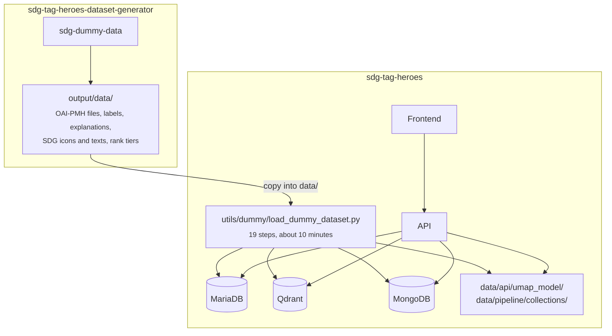

# Dummy dataset: from an empty machine to a running game

This guide sets up SDG Tag Heroes from scratch with **fictional data**: it generates publications with the
[dataset generator](https://github.com/HuberNicolas/sdg-tag-heroes-dataset-generator), runs the complete pipeline
(SDG predictions, embeddings, UMAP maps, topics), loads everything the game needs (SDGs, users, labels, explanations,
simulated players) into the Docker databases, and starts the API and the frontend.

The goal is a **working system**, not realistic labels: the publications are made up, so predictions, topics and
votes only look plausible.

## Contents

- [TL;DR](#tldr)
- [What happens](#what-happens)
- [Prerequisites](#prerequisites)
- [Step by step](#step-by-step)
  1. [Clone both repositories](#1-clone-both-repositories)
  2. [Generate the publications](#2-generate-the-publications)
  3. [Copy the data into SDG Tag Heroes](#3-copy-the-data-into-sdg-tag-heroes)
  4. [Create the environment files](#4-create-the-environment-files)
  5. [Start the databases and the API](#5-start-the-databases-and-the-api)
  6. [Set up the Python environment](#6-set-up-the-python-environment)
  7. [Run the pipeline and load everything](#7-run-the-pipeline-and-load-everything)
  8. [Restart the API and start the frontend](#8-restart-the-api-and-start-the-frontend)
- [Check the result](#check-the-result)
- [If something fails](#if-something-fails)
- [Start over](#start-over)

## TL;DR

Run these commands in a terminal, in an empty folder. Each block is explained in [Step by step](#step-by-step).

```bash
# 1. Clone both repositories side by side
git clone https://github.com/HuberNicolas/sdg-tag-heroes.git
git clone https://github.com/HuberNicolas/sdg-tag-heroes-dataset-generator.git

# 2. Generate 600 fictional publications (a few seconds)
cd sdg-tag-heroes-dataset-generator
uv sync
uv run sdg-dummy-data --count 600 --out output
cd ../sdg-tag-heroes

# 3. Copy them into the data folder of SDG Tag Heroes
mkdir -p data/api
cp -R ../sdg-tag-heroes-dataset-generator/output/data/. data/

# 4. Environment files with random passwords, PREDICTION_MODEL=Dvdblk, 3 map parts
python3 utils/docker/create_env_files.py --dummy-dataset
echo "NUXT_PUBLIC_MAP_PARTITIONS=3" >> frontend/.env

# 5. Databases and API (the first build takes a while)
docker compose up -d --build api mariadb mongodb qdrantdb
docker compose exec mariadb sh -c 'until mariadb-admin ping -u root -p"$MYSQL_ROOT_PASSWORD" --silent; do sleep 2; done'

# 6. Python environment for the dataset scripts
uv python install 3.10.14
poetry -C pipeline env use "$(uv python find 3.10.14)"
poetry -C pipeline install --no-root
source "$(poetry -C pipeline env info --path)/bin/activate"

# 7. The whole pipeline: predictions, embeddings, UMAP, topics, SDGs, users, labels, explanations, fixtures
PYTHONPATH=. python utils/dummy/load_dummy_dataset.py

# 8. Restart the API so it loads the new UMAP models, then start the frontend
docker compose restart api
docker compose up -d --build frontend
```

Open <http://localhost:3030> and log in. Step 4 printed the accounts and their passwords; they are also in
`env/users.env`.

## What happens



The generator replaces only the external sources of the thesis: ZORA (the publications) and SDG-Scout (ground-truth
labels and explanations). Everything else is computed by the same scripts that built the original dataset
([Building the dataset](dataset.md)).

## Prerequisites

| Tool                                             | Version          | Used for                                          |
|--------------------------------------------------|------------------|---------------------------------------------------|
| [Docker](https://docs.docker.com/get-docker/)    | with Compose v2  | Databases, API, frontend                          |
| [git](https://git-scm.com/)                      | any              | Cloning the repositories                          |
| [uv](https://docs.astral.sh/uv/)                 | any              | The generator, and installing Python 3.10.14      |
| [Poetry](https://python-poetry.org/)             | 1.8 or newer     | The Python environment of the dataset scripts     |
| Python                                           | 3.9 or newer     | `create_env_files.py` in step 4                   |
| C compiler                                       | –                | `hdbscan` is compiled during step 6: Xcode Command Line Tools on macOS, `build-essential` on Debian and Ubuntu |

Install Poetry with uv if you do not have it: `uv tool install poetry`.

**Resources:** about 15 GB of free disk space for the Docker images, the Python packages and the models, and 8 GB of
RAM. The first run needs internet: Docker images, Python packages, and two models from Hugging Face (SciBERT, about
420 MB, and all-MiniLM-L6-v2, about 90 MB).

**Ports:** 1002 (API), 2001–2003 (databases) and 3030 (frontend) must be free. If another SDG Tag Heroes stack runs on
the machine, stop it first (`docker compose down` in its folder), because the container names are fixed.

## Step by step

### 1. Clone both repositories

```bash
git clone https://github.com/HuberNicolas/sdg-tag-heroes.git
```

```bash
git clone https://github.com/HuberNicolas/sdg-tag-heroes-dataset-generator.git
```

The commands below assume that both folders are next to each other.

### 2. Generate the publications

```bash
cd sdg-tag-heroes-dataset-generator
```

```bash
uv sync
```

```bash
uv run sdg-dummy-data --count 600 --out output
```

This writes 600 publications with **template abstracts** in a few seconds. That is enough to test the system. For
more realistic abstracts and more varied topics, write them with a model instead:

| Command                                                     | Cost | Time for 600 papers |
|-------------------------------------------------------------|------|---------------------|
| `uv run sdg-dummy-data --count 600 --out output`            | free | seconds             |
| `uv run sdg-dummy-data --count 600 --out output --mode ollama` | free, needs [Ollama](https://ollama.com) and `ollama pull llama3.2` | hours on a CPU |
| `uv run sdg-dummy-data --count 600 --out output --mode llm` | paid, needs `uv sync --extra llm` and an Anthropic API key | minutes |

The [generator's README](https://github.com/HuberNicolas/sdg-tag-heroes-dataset-generator#three-ways-to-write-the-abstracts)
describes the modes. Keep `--count` at about 600: with far fewer publications, many SDGs have too few papers for a map.

Then go to SDG Tag Heroes:

```bash
cd ../sdg-tag-heroes
```

### 3. Copy the data into SDG Tag Heroes

```bash
mkdir -p data/api
```

```bash
cp -R ../sdg-tag-heroes-dataset-generator/output/data/. data/
```

`data/api/` must exist before the API image is built (the image copies it). The copy creates:

| Folder                  | Content                                                      |
|-------------------------|--------------------------------------------------------------|
| `data/pipeline/oai/`    | The publications as OAI-PMH files, read by the collector     |
| `data/db/`              | Ground-truth labels and token-level explanations             |
| `data/icons/`           | Placeholder SDG icons and the SDG texts (`sdg_extras.json`)  |
| `data/ranks/`           | Rank tiers per SDG                                           |

### 4. Create the environment files

```bash
python3 utils/docker/create_env_files.py --dummy-dataset
```

[`create_env_files.py`](../utils/docker/create_env_files.py) creates every `env/<service>.env` from its template with
random passwords, `frontend/.env`, and a `.env` in the repository root with `PREDICTION_MODEL=Dvdblk`. Docker Compose
reads that file, so the API uses the predictions of the SciBERT model (`Dvdblk`) that the pipeline computes. The
script prints the three accounts and their passwords. It never overwrites an existing file.

The dummy dataset is small, so split the overview map into 3 parts instead of 1000:

```bash
echo "NUXT_PUBLIC_MAP_PARTITIONS=3" >> frontend/.env
```

`env/api.env` keeps an empty `OPENAI_API_KEY`. Everything works without it except the GPT features (summaries,
keywords, comment evaluation).

### 5. Start the databases and the API

```bash
docker compose up -d --build api mariadb mongodb qdrantdb
```

The first build of the API image takes several minutes (it installs PyTorch). Wait until MariaDB accepts
connections; the command returns as soon as it does:

```bash
docker compose exec mariadb sh -c 'until mariadb-admin ping -u root -p"$MYSQL_ROOT_PASSWORD" --silent; do sleep 2; done'
```

Check that the API is up: <http://localhost:1002/docs> shows the API reference.

### 6. Set up the Python environment

The dataset scripts run on your machine, in the Poetry environment of
[`pipeline/pyproject.toml`](../pipeline/pyproject.toml), with exactly Python 3.10.14.

```bash
uv python install 3.10.14
```

```bash
poetry -C pipeline env use "$(uv python find 3.10.14)"
```

```bash
poetry -C pipeline install --no-root
```

```bash
source "$(poetry -C pipeline env info --path)/bin/activate"
```

The installation takes a few minutes (PyTorch, BERTopic, UMAP). The last command activates the environment in the
current terminal; in a new terminal, run it again.

### 7. Run the pipeline and load everything

From the repository root, with the environment active:

```bash
PYTHONPATH=. python utils/dummy/load_dummy_dataset.py
```

[`load_dummy_dataset.py`](../utils/dummy/load_dummy_dataset.py) runs the regular dataset scripts one after the other
and prints each step with its duration. The times below were measured on an Intel MacBook (CPU only) with 600
publications; the first run also downloads the two models.

| Step                  | Script                                        | What it does                                                         | Time   |
|-----------------------|-----------------------------------------------|----------------------------------------------------------------------|-------:|
| `schema`              | `db/scripts/init_mariadb.py`                  | Creates all MariaDB tables                                           | 2 s    |
| `collector`           | `pipeline/zora/collector.py --from-dir …`     | Reads the OAI-PMH files: publications, authors, faculties, institutes, divisions | 15 s |
| `predictions`         | `pipeline/zora/predictor_dvdblk.py`           | SciBERT scores for the 17 SDGs of every publication                  | 3 min  |
| `entropy`             | `load_mariadb_sdg_predictions_entropy.py`     | Entropy and standard deviation of every prediction                   | 1 s    |
| `embeddings`          | `pipeline/zora/loader.py`                     | Sentence embeddings of title and abstract → Qdrant                   | 30 s   |
| `umap`                | `load_mariadb_umap.py`                        | 2D maps per SDG and level; saves the UMAP models to `data/api/`      | 30 s   |
| `topics`              | `generate_umap_with_tm.py`                    | BERTopic topics and the overview map → `data/pipeline/collections/`  | 1.5 min |
| `topic-names`         | `simplify_topic_info.py`                      | Short topic names from the top keywords                              | 1 s    |
| `sdgs`                | `load_mariadb_sdg.py`                         | 17 SDG goals and 169 targets with icons                              | 1 s    |
| `sdg-extras`          | `load_mariadb_sdg_extras.py`                  | Short titles, keywords and explanations of the goals                 | 1 s    |
| `ranks`               | `load_mariadb_sdg_ranks.py`                   | Rank tiers per SDG                                                   | 1 s    |
| `users`               | `load_mariadb_users.py`                       | The accounts from `env/users.env`                                    | 5 s    |
| `players`             | `load_mariadb_users.py --generate 40`         | 40 simulated players                                                 | 10 s   |
| `labels`              | `load_mariadb_sdg_label_summaries.py`         | Ground-truth labels and label histories                              | 1 s    |
| `collections`         | `load_mariadb_collections.py`                 | Topics as collections, overview map coordinates                      | 2 s    |
| `mongo-sdgs`          | `load_mongodb_sdg.py`                         | SDG goals and targets in MongoDB                                     | 2 s    |
| `explanations`        | `load_mongodb_explanations.py`                | Token-level explanations → MongoDB                                   | 1 s    |
| `explanations-scaled` | `load_mongodb_small_explanations.py`          | The compact copy of the explanations that the API reads              | 2 s    |
| `fixtures`            | `load_mariadb_fixtures.py --no-gpt --max-publications 300` | Simulated game activity: wallets, XP, votes, comments, scenarios for 300 publications | 1.5 min |

In total about 8 minutes, plus the model downloads on the first run. The fixtures write comments with Faker, so no
OpenAI key is needed. To let GPT write them instead (costs money), add `--gpt`.

> [!NOTE]
> The script only starts on **empty databases**: it stops if MariaDB already contains publications or Qdrant already
> contains embeddings, because several scripts drop or truncate what they fill.

### 8. Restart the API and start the frontend

The API loads the UMAP models when it starts, so restart it:

```bash
docker compose restart api
```

Start the frontend (hot reload, port 3030):

```bash
docker compose up -d --build frontend
```

Open <http://localhost:3030> and log in with an account from step 4, e.g. `labeler@tagheroes.ch`. The 40 simulated
players can log in too: `<lastname>@example.org` with the password `password01`.

To run the frontend without Docker instead, see the [frontend README](../frontend/README.md#getting-started).

## Check the result

**Counts in the databases** (with the default of 600 publications):

```bash
docker compose exec mariadb sh -c 'mariadb -u"$MARIADB_USER" -p"$MARIADB_PASSWORD" igcl -e "SELECT (SELECT COUNT(*) FROM publications) AS publications, (SELECT COUNT(*) FROM sdg_predictions) AS predictions, (SELECT COUNT(*) FROM dimensionality_reductions) AS map_points, (SELECT COUNT(*) FROM collections) AS topics, (SELECT COUNT(*) FROM users) AS users, (SELECT COUNT(*) FROM sdg_label_decisions) AS decisions"'
```

```bash
curl -s -X POST http://localhost:2003/collections/publications-mt/points/count -H 'Content-Type: application/json' -d '{}'
```

| Value            | Expected                                                              |
|------------------|-----------------------------------------------------------------------|
| publications     | 600                                                                   |
| predictions      | 1200 (one placeholder from the collector and one SciBERT prediction per publication) |
| map_points       | about 2000                                                            |
| topics           | a few (template abstracts) to about 20 (model-written abstracts)      |
| users            | the accounts from `users.env` plus 40 players                         |
| decisions        | 300                                                                   |
| Qdrant `count`   | 600                                                                   |

**Log in through the API:**

```bash
PASSWORD=$(sed -n 's/^USER_2_PASSWORD=//p' env/users.env)
```

```bash
curl -s -X POST http://localhost:1002/auth/login -H 'Content-Type: application/json' -d "{\"email\": \"labeler@tagheroes.ch\", \"password\": \"$PASSWORD\"}"
```

The answer contains an `access_token`.

**Click through the frontend:**

1. `/scenarios`: the glyphs of the SDGs and the scenario overview appear.
2. Choose an SDG: the map shows the publications of that SDG, with the publication table next to it.
3. Open a publication: the labeling page shows the abstract with highlighted words (the explanations), the
   prediction glyph and the votes of the simulated players.
4. `/exploration/publications/1`: the overview map with the topics.

## If something fails

| Problem                                                    | Fix                                                                                   |
|------------------------------------------------------------|---------------------------------------------------------------------------------------|
| A step of `load_dummy_dataset.py` fails                    | Fix the cause and resume at that step: `PYTHONPATH=. python utils/dummy/load_dummy_dataset.py --from-step <name>` (the script prints the command) |
| "Refusing to load the dummy dataset: … already contains …" | The databases are not empty; [start over](#start-over)                               |
| "Can't connect to MySQL server"                            | MariaDB is not ready yet or not running: `docker compose ps`, then the wait command from step 5 |
| `docker compose up` fails with `"/data/api": not found`    | `mkdir -p data/api` (step 3) and build again                                          |
| A container name or port is already in use                 | Another stack runs; stop it with `docker compose down` in its folder                  |
| "No space left on device" in a database container          | Docker's disk is full; see [Docker](docker.md#cleaning-up)                            |
| `hdbscan` fails to build in step 6                         | Install a C compiler (see [Prerequisites](#prerequisites)) and repeat the install      |
| Maps are empty in the frontend                             | Check that `.env` contains `PREDICTION_MODEL=Dvdblk`, then `docker compose up -d api` and `docker compose restart api` |
| The overview map stays empty                               | `NUXT_PUBLIC_MAP_PARTITIONS=3` in `frontend/.env`, then `docker compose restart frontend` |
| An SDG has no map                                          | Expected: SciBERT rarely scores some SDGs (often SDG 17) above 0.7                   |

More errors and fixes are in [Troubleshooting](troubleshooting.md).

## Start over

Stop the containers, delete the database contents and the computed files, and run step 7 again:

```bash
docker compose down
```

```bash
bash utils/docker/delete-docker-data.sh
```

```bash
rm -rf data/api/umap_model data/pipeline/collections
```

```bash
docker compose up -d api mariadb mongodb qdrantdb
```

`delete-docker-data.sh` removes `data/docker/` with `sudo`. The generated publications in `data/pipeline/oai/` stay;
to use new ones, generate them again (step 2) and copy them (step 3).
