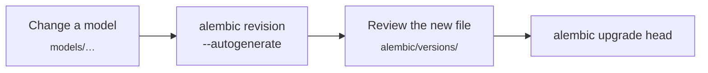

# Migrations

The MariaDB schema is defined by the SQLAlchemy models in [`models/`](../models). [Alembic](https://alembic.sqlalchemy.org/)
keeps the database in step with them. The migrations are in [`alembic/versions/`](../alembic/versions).

Run the commands from the repository root, in the [Python environment](development.md#python-environment) of the
scripts, while the `mariadb` container is running. [`alembic/env.py`](../alembic/env.py) builds the connection from
`env/mariadb.env`: on your machine it uses `MARIADB_HOST_LOCAL` and `MARIADB_PORT_LOCAL`, in Docker (`IN_DOCKER=true`)
`MARIADB_HOST` and `MARIADB_PORT`.

## Workflow



1. **Change a model**, for example add a column.
2. **Generate a migration.** Alembic compares the models with the database and writes the difference to a new file in
   `alembic/versions/`:

   ```bash
   PYTHONPATH=. alembic revision --autogenerate -m "Add nickname to users"
   ```

3. **Review the file.** Autogenerate does not detect everything, for example renamed columns or changed enum values.
   Edit `upgrade()` and `downgrade()` where needed.
4. **Apply it.** This also stores the new revision in the table `alembic_version`:

   ```bash
   PYTHONPATH=. alembic upgrade head
   ```

5. Commit the model change together with the migration.

## Useful commands

| Command                        | What it does                                                        |
|--------------------------------|---------------------------------------------------------------------|
| `alembic current`              | Shows the revision the database is on                               |
| `alembic heads`                | Shows the newest revision in `alembic/versions/`                    |
| `alembic history`              | Lists all revisions                                                 |
| `alembic upgrade head`         | Applies all pending migrations                                      |
| `alembic downgrade -1`         | Reverts the last migration                                          |
| `alembic downgrade <revision>` | Goes back to a specific revision                                    |
| `alembic stamp head`           | Marks the database as up to date without running migrations        |

Prefix each command with `PYTHONPATH=.`. The database is up to date when `current` and `heads` show the same revision.

## Check whether the models and the database match

Generate a migration without applying it:

```bash
PYTHONPATH=. alembic revision --autogenerate -m "Check model sync with DB"
```

If `upgrade()` and `downgrade()` contain only `pass`, the database matches the models. Delete the file afterwards.

## New databases

A new database does not need the migrations. [`init_mariadb.py`](../db/scripts/init_mariadb.py) creates all tables
from the models, and `alembic stamp head` records that they are up to date (see
[Building the dataset](dataset.md#1-schema)).
